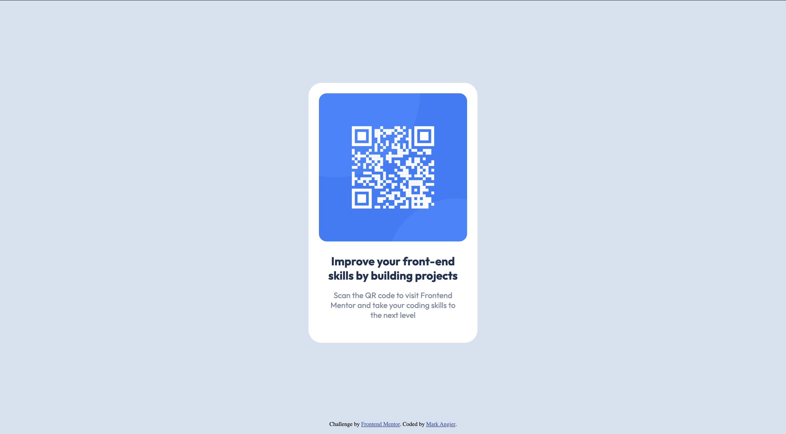

# Frontend Mentor - QR code component solution

This is a solution to the [QR code component challenge on Frontend Mentor](https://www.frontendmentor.io/challenges/qr-code-component-iux_sIO_H). Frontend Mentor challenges help you improve your coding skills by building realistic projects. 

## Table of contents

- [Overview](#overview)
  - [Screenshot](#screenshot)
- [My process](#my-process)
  - [What I learned](#what-i-learned)
  - [Continued development](#continued-development)
  - [Useful resources](#useful-resources)

## Overview

### Screenshot



## My process

### What I learned

I learned the basics of how to use a flex container, but I still struggle with centering items vertically.

```css
.container {
  height: 96vh;
  display: flex;
  justify-content: center;
  align-items: center;
}
```

### Continued development

In future projects, I definitely need to sharpen my HTML and CSS toolset, but specifically, the use of FlexBox, custom fonts, and margins. 

### Useful resources

- [Flexbox](https://css-tricks.com/snippets/css/a-guide-to-flexbox/) - Useful flexbox resource.
- [Center Align Divs](https://www.freecodecamp.org/news/how-to-center-anything-with-css-align-a-div-text-and-more/) - Useful for aligning divs.